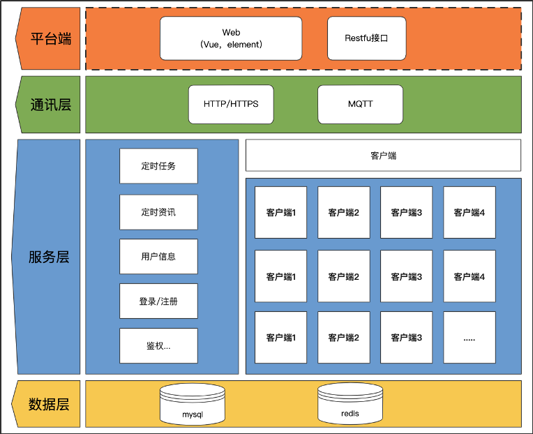

# 5G智能微秘书-设计实现说明

## 架构设计

本项目是基于Wechaty + puppet-walnut-gateway 开发的5G智能微秘书项目，得益于Wechaty的架构模式，我们在之前硬核桃开发套件的Puppet基础上,开发了一个适配硬核桃消息网关的puppet来实现5G消息的交互对话功能

### Wechaty

Wechaty 是一个开源聊天机器人框架SDK，具有高度封装、高可用的特性，支持NodeJs, Python, Go 和Java 等多语言版本。在过去的5年中，服务了数万名开发者，收获了 Github 的 9600 Star。同时配置了完整的DevOps体系并持续按照Apache 的方式管理技术社区。

### puppet-walnut-gateway 

硬核桃5G网关 Wechaty Puppet 模块 (5G微秘书团队基于puppet-walnut开发)

仓库地址: [https://gitee.com/kiventop/puppet-walnut-gateway](https://gitee.com/kiventop/puppet-walnut-gateway)

## 实现说明

《5G智能微秘书》是一个集百家之能的一个平台，通过各种普适化功能的组合配置，可以面向任意一个行业进行深耕扩展。区别于单一的5G智能机器人的是，利用《5G智能微秘书》平台可视化配置能力，分布式部署能力，还有其无限的扩展能力。可以快速的接入5G消息，创建适合不同行业的5G智能机器人。

所以在整体上采用了类Sass系统的设计架构，分为以下三端：



* Web端：可公网访问，对外提供用户注册登录功能，登录后即可进行各种参数配置
* 服务端：承载客户端与web端的通信，以及数据存储
* 客户端：客户端是需要用户自行部署的，他与web端注册的账号是一一对应的关系，所以理论上可以创建无数个客户端，然后去生成无数个5G智能微秘书去服务各行各业


## 技术栈

### web端

主框架使用Vue2.6 + element-ui 2.13.0

依赖第三方库及版本
```shell
 "@form-create/element-ui": "^2.5.6",
  "axios": "0.18.1",
  "bootstrap": "^5.1.3",
  "bootstrap-vue": "^2.21.2",
  "clipboard": "^2.0.4",
  "dayjs": "^1.10.4",
  "element-ui": "^2.13.0",
  "js-cookie": "2.2.0",
  "lodash": "^4.17.21",
  "mcanvas": "^2.0.8",
  "normalize.css": "7.0.0",
  "nprogress": "0.2.0",
  "path-to-regexp": "2.4.0",
  "qrcodejs2": "0.0.2",
  "vue": "2.6.10",
  "vue-clipboard2": "^0.3.1",
  "vue-feather-icons": "^5.1.0",
  "vue-particles": "^1.0.9",
  "vue-qr": "^2.2.1",
  "vue-router": "3.0.6",
  "vue-scrollto": "^2.20.0",
  "vue2-scrollspy": "^2.3.1",
  "vuex": "3.1.0",
  "vuex-map-fields": "^1.3.6"
```

### 服务端

主要框架Eggjs2+Mysql8+redis3

依赖第三方库及版本
```shell
"crypto": "^1.0.1",
"dayjs": "^1.9.7",
"egg": "^2.15.1",
"egg-bizerror": "^2.2.1",
"egg-errors": "^2.1.1",
"egg-mqtt-plugin": "^1.1.1",
"egg-passport": "^2.1.0",
"egg-passport-github": "^1.0.0",
"egg-redis": "^2.4.0",
"egg-scripts": "^2.11.0",
"egg-sequelize": "^5.2.0",
"egg-swagger-doc": "^2.3.2",
"egg-validate": "^2.0.2",
"hashids": "^2.1.0",
"jsonwebtoken": "^8.5.1",
"mcanvas": "^2.0.8",
"ms": "^2.1.3",
"mysql2": "^2.0.1",
"nodemailer": "^6.4.2",
"qiniu": "^7.2.2",
"qr-image": "^3.2.0",
"ratelimiter": "^3.4.1",
"sequelize-cli": "^5.5.1",
"svg-captcha": "^1.4.0"
```

### 客户端

主要框架Wechaty1.x + wechaty-puppet-walnut-gateway

依赖第三方库及版本
```shell
 "@laiye-ai/sdk-core": "^1.1.3",
    "file-type": "^17.1.2",
    "mqtt": "^4.2.6",
    "nedb": "^1.8.0",
    "node-schedule": "^1.3.2",
    "superagent": "^5.2.2",
    "tencentcloud-sdk-nodejs": "^4.0.30",
    "wechaty": "^1.20.2",
    "wechaty-puppet": "^1.20.2",
    "wechaty-puppet-walnut-gateway": "^1.0.4"
```
